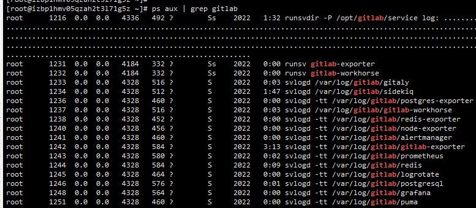

# gitlab 安装与卸载

## 安装 gitlab

1. 查看是否安装了 gitlab

   `rpm -qa | grep gitlab`

2. 如果有，卸载

   `rpm -e --nodeps gitlab-ce-****l7.x85_64`

3. 删除 `/opt/gitlab` 和 `/etc/gitlab`

4. 创建 `/etc/yum.repos.d/gitlab-ce.repo` 文件 --- [gitlab-ce.repo](gitlab-ce.repo)

5. 更新 yum 缓存

   `yum makecache`

6. 安装GitLab社区版

   * 自动安装最新版： `yum install gitlab-ce`

   * 安装指定版本：`yum install gitlab-ce-x.x.x`

7. 停止 所有 gitlab 组件

   `gitlab-ctl stop`

8. 修改GitLab 配置，GitLab 默认的配置文件路径是 `/etc/gitlab/gitlab.rb`

   * 修改访问地址：`external_url 'http://gitlab.example.com'`，也可以用域名或者IP，这里根据自己需求来即可

   * 关闭自带 nginx：`nginx['enable'] = false`

   * 使用外部 nginx 来转发：`gitlab_workhorse['listen_network'] = "tcp"`, `gitlab_workhorse['listen_addr'] = "127.0.0.1:12316"`(这个端口号一会和外部 nginx 代理的端口号要一致)

   * 监控日志改成3天后自动删除以防磁盘占用过大：
   ``` 
   prometheus['flags'] = {
      'storage.tsdb.path' => "/var/opt/gitlab/prometheus/data",
      'storage.tsdb.retention.time' => "3d",
      'config.file' => "/var/opt/gitlab/prometheus/prometheus.yml"
   }

   ```

9. 刷新配置，启动 gitlab 服务
   `gitlab-ctl stop`
   `gitlab-ctl reconfigure`
   `gitlab-ctl start`


10. 查看启动情况
   `gitlab-ctl status`

11. 相关路径
   * 安装路径：`/opt/gitlab`
   * 数据路径：`/var/opt/gitlab`
   * gitlab.rb 所在路径：`/etc/gitlab/gitlab.rb`


## gitlab 卸载

1. 停止 gitlab

   `gitlab-ctl stop`

2. 卸载gitlab(看是gitlab-ce版本还是gitlab-ee版本)
   `rpm -e gitlab-ce`

3. 查看 gitlab 进程

   `ps aux | grep gitlab`

4. 杀掉第一个进程（就是带有好多.............的进程，杀掉后，在查看gitlab进程确认一遍，还有没有gitlab的进程
   
   

   `kill -9 11111`
 

5. 删除所有包含gitlab文件

   `find / -name gitlab | xargs rm -rf`
